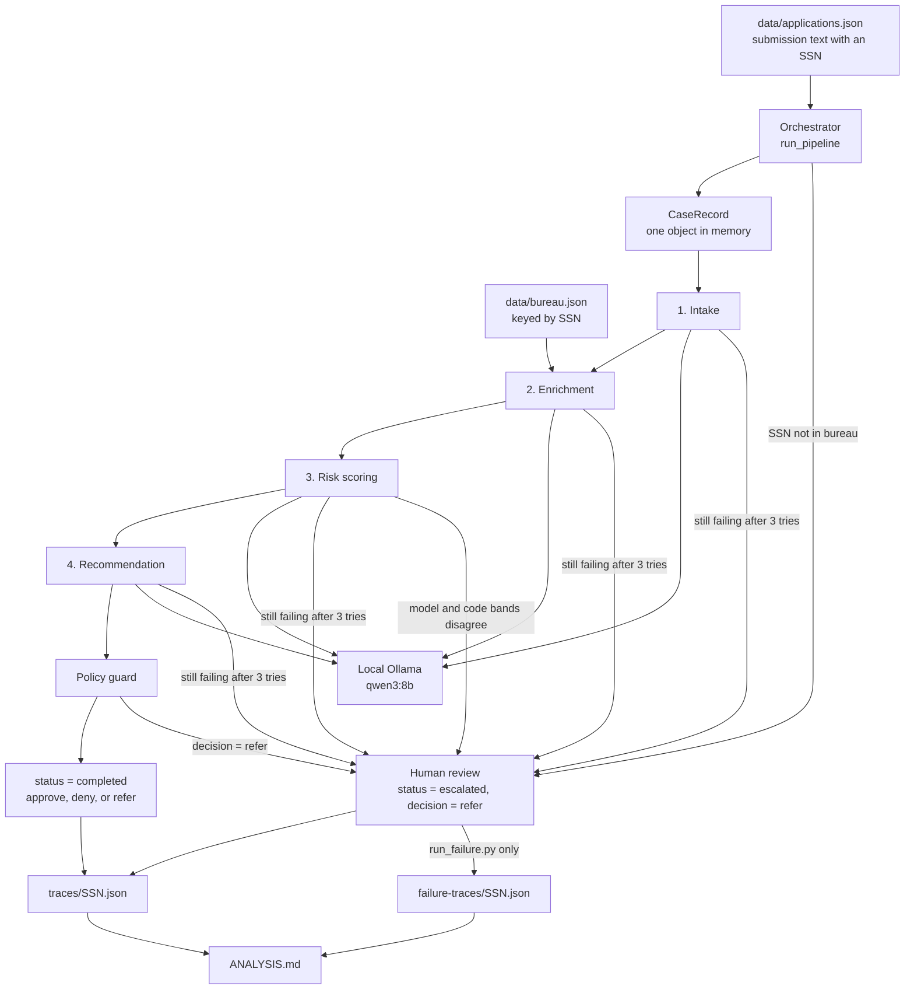
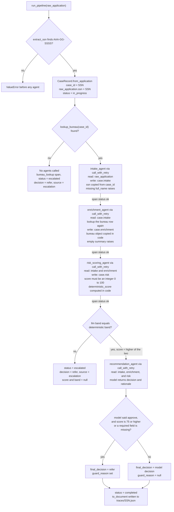
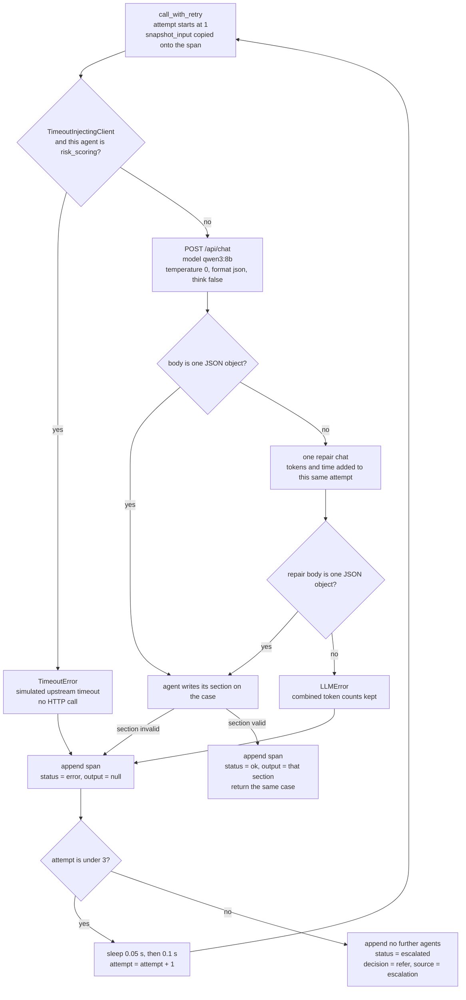

# Architecture

This pipeline underwrites one insurance application at a time. The steps are fixed in advance. Each step reads and writes one shared case object in memory.

## High-level design

An application is one sentence. A regex reads the SSN out of that sentence and uses it as the case id. The bureau is a local JSON file, not a model call.

`run_pipeline` builds one `CaseRecord` and passes that same object through intake, enrichment, risk scoring, and recommendation. The next agent sees the previous write because both hold that object. Nothing is saved between agents. The JSON under `traces/` is written only after the case finishes.

Each agent makes one JSON chat to local Ollama `qwen3:8b`. A policy guard can change an `approve` to `refer` when the score is 75 or higher or required intake fields are missing.

Risk scoring also computes a deterministic score from the bureau row in code. Both scores are mapped to low, medium, or high. If the bands agree, the case keeps the higher score. If they disagree, the model's number is not trusted on its own.

A finished `refer` is a normal outcome: `status = completed`, `source = model`. Three things stop the chain with `status = escalated`, `decision = refer`, `source = escalation`: a missing bureau SSN, any agent that still fails after three tries, or a risk band disagreement. Later agents do not run. A disagreement is not retried, because the model call succeeded.

`ANALYSIS.md` totals completed cases only. Escalated cases, from `traces/` and `failure-traces/`, are listed in their own section with the time and tokens spent before they stopped.

There is no cross-case memory. One application cannot see another.

### Run one case

`python3 quote.py "Priya Shah, 31, librarian in Vermont. ... SSN 900-01-0001."` runs a single sentence through the same `run_pipeline`, prints the span summary, and writes `quotes/{ssn}.json`. That folder is ignored by git and is not read by the cost analysis, so ad hoc quotes never change the batch analysis. There is no warm-up call, so a cold model makes the first quote slower than the batch numbers. Exit code 0 means completed, 1 means escalated, and 2 means the text had no SSN. `--no-save` prints without writing a file.

## Low-level design

One case through `run_pipeline`. The same `CaseRecord` is passed down the left column. Each box names the function, what it reads, and what it writes.

A failed attempt does not jump back to intake. It stays inside `call_with_retry` for that same agent. After three failures the pipeline stops, so the agents below that box never run.

