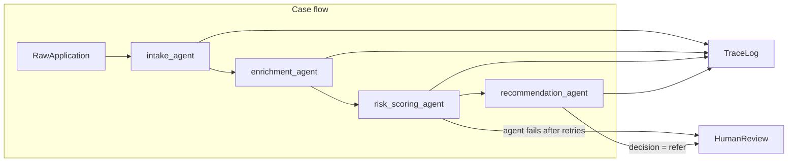

# State and memory

## Decision

This pipeline uses a **shared case record**, passed explicitly through a fixed orchestrator.

It is not message passing, and it is not a hidden global. Each agent receives the same `CaseRecord`, reads the sections it needs, and writes its own section back. The orchestrator is a fixed sequence: intake, enrichment, risk scoring, recommendation. The steps are known in advance, so this is a workflow (prompt chaining), not an agent that decides what to run next.

## Why

An underwriting file is the unit of work. Enrichment needs the normalized application, risk scoring needs the bureau facts, and the recommendation needs the score. A failed step has to leave the earlier sections intact for a human underwriter. The trace snapshots that same record, so the log and the case stay aligned.

There is no cross-case memory. One application cannot see another.

The record lives in `underwriting/state.py`:

- `raw_application` — original submission
- `intake` — normalized applicant, coverage, household
- `enrichment` — bureau facts plus the model's gap and red-flag summary
- `risk` — score 0–100, band, factors
- `recommendation` — `approve`, `deny`, or `refer`, with a rationale and a `source` of `model` or `escalation`
- `status` — `in_progress`, `completed`, or `escalated`

## Flow

TraceLog sits to the left of the case flow and HumanReview sits to the right, so those edges leave the chain sideways.

Shared CaseRecord is read and written by every agent.

The failure arrow is drawn from `risk_scoring_agent` because that is the simulated timeout. The same retry-then-escalate path applies to every agent: if intake, enrichment, risk scoring, or recommendation still fails after retries, the case goes to HumanReview and later agents do not run. A normal `decision = refer` from `recommendation_agent` is a second, separate path into HumanReview. That case finished successfully.

## What each agent reads and writes

- **Intake** reads `raw_application`. Writes `intake`.
- **Enrichment** reads `intake`, then a local bureau lookup. Writes `enrichment`.
- **Risk** reads `intake` and `enrichment`. Writes `risk`.
- **Recommendation** reads `intake`, `enrichment`, and `risk`. Writes `recommendation`.

A policy guard stops an `approve` when the score is 75 or higher, or when required sections are missing. The recommendation span always stores `model_decision`, `final_decision`, and `guard_reason`. When the guard changes the decision, `guard_reason` says why. When it does not, `guard_reason` is null. `decision = refer` sends the finished case to a human underwriter.
